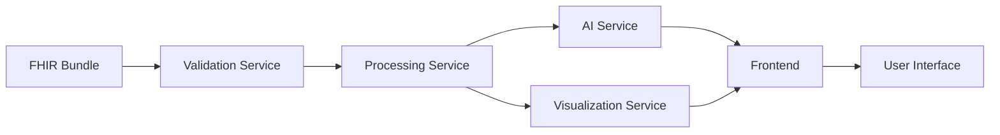

# ADR-003: Plumly vNext Architecture Decisions

**Status**: Proposed
**Date**: 2025-01-26
**Deciders**: Development Team
**Technical Story**: Implementation of comprehensive FHIR summarization platform

## Context and Problem Statement

Plumly vNext requires a robust architecture that can handle complex FHIR bundle processing, real-time AI summarization, multi-persona rendering, and strong provenance tracking while maintaining clinical safety standards and sub-6-second performance requirements.

## Decision Drivers

- **Performance Requirements**: Sub-6s summary generation, sub-200ms chart rendering
- **Clinical Safety**: Complete provenance and auditability requirements
- **Multi-Persona Support**: Dynamic content rendering for Patient/Provider/Caregiver
- **Scalability**: Handle 10MB FHIR bundles with complex resource relationships
- **User Experience**: Responsive, interactive interface with progressive disclosure
- **Integration**: Support for file upload and live FHIR server connections
- **Maintainability**: Clear separation of concerns, testable components

## Considered Options

### Option 1: Monolithic Full-Stack Architecture
- Single Next.js application with integrated API routes
- Client-side FHIR processing and AI integration
- Local state management for all persona switching

### Option 2: Microservices Architecture
- Separate services for FHIR processing, AI summarization, and UI
- Message queue for asynchronous processing
- Independent scaling and deployment

### Option 3: Hybrid Architecture (Chosen)
- Next.js frontend with dedicated backend API services
- Separation between FHIR processing and AI services
- Shared state management with caching layer

## Decision Outcome

Chosen option: "**Hybrid Architecture**", because it provides the optimal balance of performance, maintainability, and development velocity while supporting our clinical safety and user experience requirements.

### Positive Consequences

- **Performance Optimization**: Dedicated processing services can be optimized independently
- **Clear Separation**: FHIR validation separate from AI processing separate from UI rendering
- **Scalability**: Backend services can scale independently based on load
- **Testing**: Each service can be tested in isolation with appropriate test data
- **Security**: Sensitive processing isolated from client-side code
- **Development Velocity**: Team can work on different services concurrently

### Negative Consequences

- **Complexity**: More moving parts than a monolithic approach
- **Deployment**: Requires orchestration of multiple services
- **Network Latency**: Inter-service communication overhead
- **State Management**: More complex data flow between services

## Architectural Components

### Frontend Layer (Next.js/React)
```typescript
// Core Components
- PersonaToggle: Switch between Patient/Provider/Caregiver views
- SummaryDisplay: Render AI-generated summaries with provenance chips
- HighlightsPanel: Show actionable clinical insights and risks
- VisualizationEngine: Charts for labs, vitals, medication timelines
- ProvenanceViewer: Detailed FHIR resource inspection
- ReasoningTrail: AI decision explanation interface
```

### API Gateway (Next.js API Routes)
```typescript
// Endpoints
POST /api/bundles/upload     // File upload handling
POST /api/bundles/fetch      // FHIR server integration
POST /api/summarize          // AI summary generation
GET  /api/highlights         // Risk and gap analysis
GET  /api/provenance/:id     // Resource provenance details
POST /api/export             // PDF and sharing functionality
```

### FHIR Processing Service
```typescript
// Responsibilities
- Bundle validation (US Core R4 compliance)
- Resource extraction and normalization
- Relationship mapping between resources
- Data quality assessment
- Cache management for processed bundles
```

### AI Summarization Service
```typescript
// Responsibilities
- Persona-specific prompt engineering
- Claude API integration and retry logic
- Provenance tracking for all AI outputs
- Confidence scoring and uncertainty marking
- Response caching and optimization
```

### Visualization Service
```typescript
// Responsibilities
- Time-series data extraction from observations
- Chart data preparation and optimization
- Medication timeline construction
- Trend analysis and anomaly detection
```

## Implementation Details

### Data Flow Architecture


### State Management Strategy
- **React Query**: Server state management with intelligent caching
- **Zustand**: Client-side state for UI preferences and persona settings
- **Context API**: Global app state for user session and configuration

### Performance Optimization
- **Bundle Processing**: Streaming JSON parsing for large files
- **AI Requests**: Request batching and response caching
- **Chart Rendering**: Virtualization for large datasets
- **Image Optimization**: Next.js automatic image optimization
- **Code Splitting**: Dynamic imports for persona-specific components

### Security Architecture
- **Input Validation**: Comprehensive FHIR bundle sanitization
- **API Security**: Rate limiting, request validation, CORS configuration
- **Data Isolation**: Separate processing pipelines for demo vs. production
- **Audit Logging**: Complete trail of all data access and processing

## Technology Stack Decisions

### Frontend Technologies
- **Next.js 14**: App router, server components, streaming
- **TypeScript**: Strong typing for FHIR resources and API contracts
- **Tailwind CSS**: Utility-first styling with design system
- **Recharts**: Chart library optimized for healthcare data visualization
- **React Hook Form**: Form handling with validation
- **Framer Motion**: Animation library for smooth transitions

### Backend Technologies
- **Node.js**: JavaScript runtime for API services
- **FastAPI**: Alternative for Python-based AI processing if needed
- **Redis**: Caching layer for processed bundles and AI responses
- **PostgreSQL**: Persistent storage for user sessions and audit logs
- **Docker**: Containerization for consistent deployment

### AI and Processing
- **Claude 3.5 Sonnet**: Primary AI model for summarization
- **FHIR.js**: JavaScript FHIR processing library
- **US Core Implementation Guide**: Validation rules and profiles
- **RxNorm**: Drug interaction and medication data
- **LOINC**: Laboratory result standardization

### Development and Deployment
- **GitHub Actions**: CI/CD pipeline with automated testing
- **Vercel**: Frontend deployment with edge functions
- **Railway/Render**: Backend service deployment
- **Sentry**: Error monitoring and performance tracking
- **Playwright**: End-to-end testing framework

## Quality Assurance Strategy

### Testing Approach
```typescript
// Test Pyramid
Unit Tests (70%)
  - FHIR validation logic
  - AI prompt engineering
  - Chart data processing
  - Component rendering

Integration Tests (20%)
  - API endpoint functionality
  - Service-to-service communication
  - Database interactions

End-to-End Tests (10%)
  - Complete user workflows
  - Persona switching
  - Performance benchmarking
```

### Performance Monitoring
- **Core Web Vitals**: LCP, FID, CLS tracking
- **Custom Metrics**: FHIR processing time, AI response time
- **Real User Monitoring**: Actual user experience data
- **Synthetic Monitoring**: Automated performance checks

### Clinical Validation
- **Accuracy Testing**: Clinician review of AI-generated content
- **Provenance Verification**: Ensure all claims traceable to sources
- **Edge Case Handling**: Malformed bundle graceful degradation
- **Compliance Checking**: US Core R4 validation coverage

## Migration and Rollout Strategy

### Phase 1: Foundation (Weeks 1-4)
- Core architecture implementation
- Basic FHIR processing pipeline
- Simple AI summarization
- MVP persona switching

### Phase 2: Enhancement (Weeks 5-8)
- Advanced visualization components
- Comprehensive provenance system
- Performance optimization
- Enhanced error handling

### Phase 3: Polish (Weeks 9-12)
- Export and sharing features
- Multi-patient dashboard
- Final performance tuning
- Demo optimization

## Monitoring and Observability

### Application Metrics
- **Response Times**: P50, P95, P99 for all critical paths
- **Error Rates**: 4xx, 5xx responses by endpoint
- **Throughput**: Requests per second, concurrent users
- **Cache Performance**: Hit rates, eviction patterns

### Business Metrics
- **User Engagement**: Persona switching frequency, feature usage
- **Clinical Accuracy**: Reviewer agreement scores
- **Performance Goals**: Achievement of sub-6s, sub-200ms targets
- **User Satisfaction**: Task completion rates, error recovery

### Alerting Strategy
- **Critical Alerts**: Service downtime, data corruption, security breaches
- **Performance Alerts**: Response time degradation, error rate spikes
- **Business Alerts**: Accuracy score drops, user experience issues

## Future Considerations

### Scalability Enhancements
- **Horizontal Scaling**: Service replication and load balancing
- **Database Optimization**: Query optimization, read replicas
- **CDN Integration**: Global content delivery for static assets
- **Edge Computing**: Processing closer to users

### Feature Extensions
- **Multi-Language Support**: I18n for non-English users
- **Advanced Analytics**: Longitudinal health trends
- **Integration APIs**: EHR vendor partnerships
- **Mobile Applications**: Native iOS/Android apps

### Compliance Evolution
- **HIPAA Readiness**: Full PHI handling capabilities
- **International Standards**: HL7 FHIR R5, international profiles
- **Clinical Guidelines**: Integration with evidence-based protocols
- **Quality Measures**: CQM and HEDIS reporting support

## Links

- [Plumly vNext Specification](../specs/004-plumly-vnext-specification.md)
- [Technology Stack ADR](001-technology-stack-selection.md)
- [Project Constitution](../../README.md#constitution)
- [FHIR US Core Implementation Guide](https://www.hl7.org/fhir/us/core/)

---

**Next Review**: 2025-02-15
**Dependencies**: Completion of current POC, Claude API access scaling