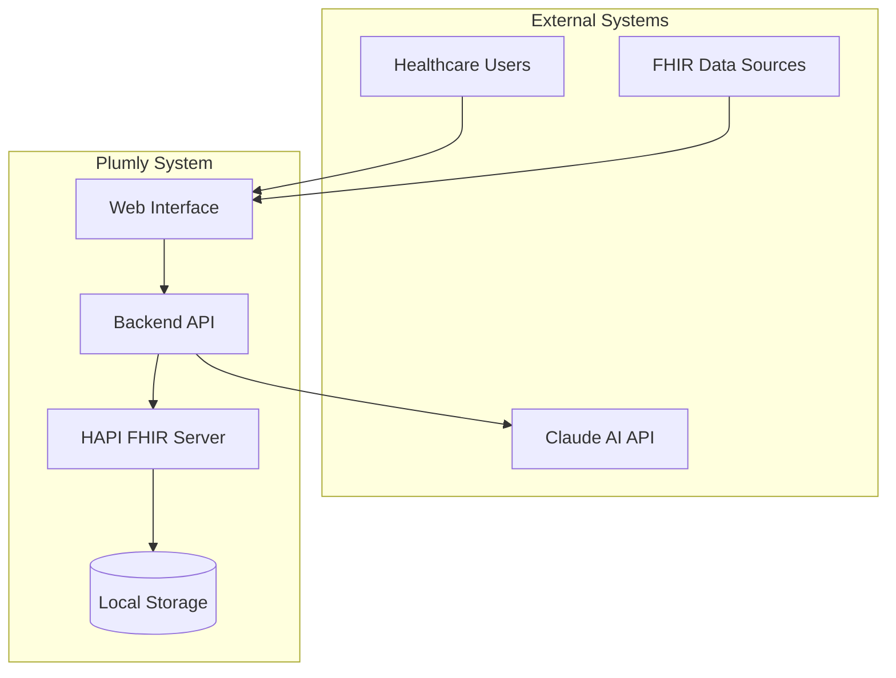
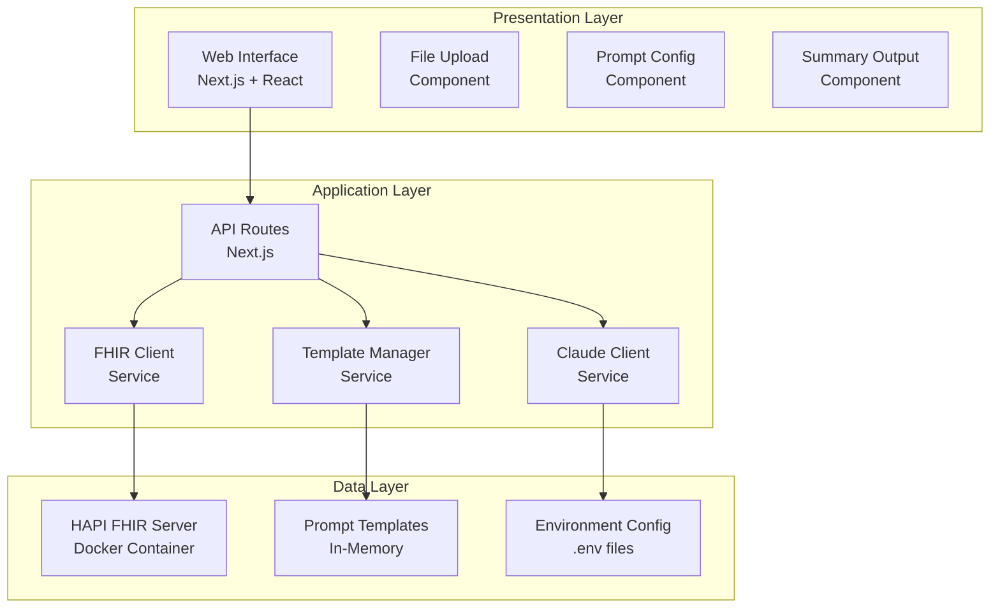
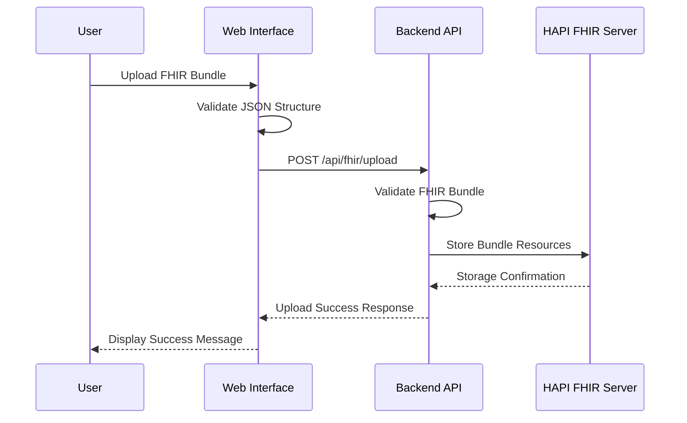
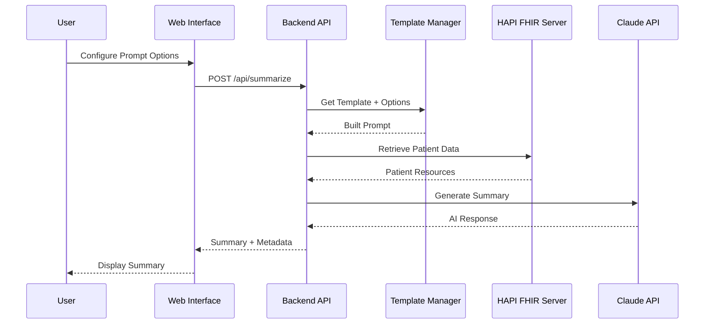
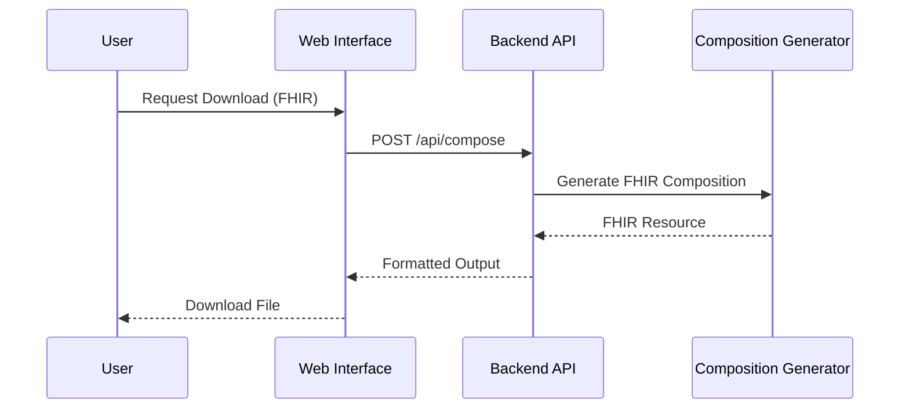

# System Architecture Overview

**Document Version:** 1.0
**Last Updated:** 2024-01-23
**Authors:** Claude Code AI

## Executive Summary

Plumly is a proof-of-concept application that demonstrates AI-powered summarization of FHIR healthcare data. The system ingests FHIR bundles, processes them through configurable AI prompts, and generates summaries in multiple formats suitable for patients, healthcare providers, and payers.

## System Context



## High-Level Architecture

### Layer Architecture



## Component Details

### Frontend Components

#### Web Interface (Next.js + React)
- **Purpose:** Provide user interface for FHIR data upload and summary generation
- **Technology:** Next.js 15 with App Router, TypeScript, Tailwind CSS
- **Key Features:**
  - Responsive design supporting desktop and tablet
  - Drag-and-drop file upload with validation
  - Real-time configuration of prompt options
  - Multiple export formats for generated summaries

#### File Upload Component
- **Purpose:** Handle FHIR bundle upload and validation
- **Features:**
  - Drag-and-drop interface
  - JSON file validation
  - FHIR bundle structure verification
  - Progress indicators and error feedback

#### Prompt Configuration Component
- **Purpose:** Allow users to customize summarization parameters
- **Features:**
  - Template selection (patient, provider, payer)
  - Output format selection (narrative, structured, FHIR)
  - Focus area specification
  - Recommendation inclusion options

#### Summary Output Component
- **Purpose:** Display generated summaries with metadata and export options
- **Features:**
  - Tabbed interface for summary and metadata
  - Download functionality (TXT, JSON, FHIR)
  - Performance metrics display
  - Resource count visualization

### Backend Services

#### API Routes (Next.js)
- **Purpose:** Provide RESTful API endpoints for frontend operations
- **Endpoints:**
  - `POST /api/fhir/upload` - Upload and validate FHIR bundles
  - `POST /api/summarize` - Generate AI-powered summaries
  - `POST /api/compose` - Create FHIR compositions from summaries
  - `GET /api/templates` - Retrieve available prompt templates

#### FHIR Client Service
- **Purpose:** Interface with HAPI FHIR server for data operations
- **Capabilities:**
  - Bundle upload and storage
  - Resource querying and retrieval
  - Patient data aggregation
  - FHIR-compliant operations

#### Claude Client Service
- **Purpose:** Integrate with Anthropic Claude API for summarization
- **Capabilities:**
  - Prompt template processing
  - AI model interaction
  - Response parsing and validation
  - Error handling and retry logic

#### Template Manager Service
- **Purpose:** Manage prompt templates and customization
- **Capabilities:**
  - Template storage and retrieval
  - Dynamic prompt building
  - Customization application
  - Template validation

### Data Layer

#### HAPI FHIR Server
- **Purpose:** Provide FHIR-compliant data storage and retrieval
- **Technology:** Docker containerized HAPI FHIR server
- **Features:**
  - Full FHIR R4 specification support
  - RESTful API endpoints
  - Resource indexing and querying
  - Data persistence with Docker volumes

#### Prompt Templates
- **Purpose:** Store pre-configured prompt templates
- **Storage:** In-memory JavaScript objects
- **Templates:**
  - Patient-friendly narratives
  - Clinical provider summaries
  - Payer utilization reports
  - Specialized use cases (discharge, medication reconciliation)

## Data Flow Architecture

### Upload and Storage Flow



### Summarization Flow



### Export Flow



## Technology Stack

### Frontend Stack
- **Framework:** Next.js 15 with App Router
- **Language:** TypeScript 5.x
- **UI Library:** React 18
- **Styling:** Tailwind CSS 3.x
- **State Management:** React hooks and context
- **HTTP Client:** Fetch API

### Backend Stack
- **Runtime:** Node.js 20+
- **Framework:** Next.js API Routes
- **Language:** TypeScript 5.x
- **FHIR Server:** HAPI FHIR Server 6.x
- **AI Integration:** Anthropic Claude 3.5 Sonnet
- **Containerization:** Docker and Docker Compose

### Development Tools
- **Package Manager:** npm
- **Code Quality:** ESLint, Prettier
- **Type Checking:** TypeScript compiler
- **Version Control:** Git with GitHub
- **IDE:** VS Code with extensions

## Security Architecture

### Data Protection
- **Local Deployment:** All processing happens on local infrastructure
- **No PHI Persistence:** Patient data not permanently stored
- **Environment Security:** API keys stored in environment variables
- **Input Validation:** Comprehensive validation of all user inputs

### API Security
- **Authentication:** Not implemented for POC (local use only)
- **Rate Limiting:** Built-in through Claude API limits
- **Input Sanitization:** All inputs validated and sanitized
- **Error Handling:** Secure error messages without data leakage

### Infrastructure Security
- **Container Isolation:** Docker containers provide process isolation
- **Network Security:** Local network communication only
- **File System:** Limited file system access through containers
- **Secrets Management:** Environment variables for sensitive data

## Performance Architecture

### Response Time Targets
- **Summary Generation:** < 5 seconds end-to-end
- **File Upload:** < 2 seconds for bundles up to 1MB
- **UI Interactions:** < 500ms for all user actions
- **FHIR Operations:** < 1 second for data retrieval

### Scalability Considerations
- **Bundle Size:** Support up to 1,000 resources per patient
- **Concurrent Users:** Handle 10+ simultaneous requests
- **Memory Usage:** < 512MB per summarization request
- **Storage:** Configurable persistence for FHIR data

### Performance Optimizations
- **Template Caching:** In-memory template storage
- **Response Streaming:** Streaming responses for large outputs
- **Resource Pagination:** Chunked processing for large bundles
- **Error Recovery:** Graceful degradation and retry mechanisms

## Monitoring and Observability

### Application Metrics
- **Response Times:** API endpoint performance tracking
- **Error Rates:** Failed request monitoring
- **Resource Usage:** Memory and CPU utilization
- **User Interactions:** Frontend usage analytics

### Health Checks
- **FHIR Server:** Container health monitoring
- **Claude API:** Service availability checks
- **Application Health:** Basic health endpoint
- **Database Connectivity:** FHIR server connection validation

### Logging Strategy
- **Application Logs:** Structured logging with timestamps
- **Error Logging:** Detailed error context and stack traces
- **Access Logs:** Request/response logging for debugging
- **Audit Trail:** Summary generation and export tracking

## Deployment Architecture

### Local Development
```
Developer Machine
├── Node.js Application (localhost:3000)
├── Docker Desktop
│   └── HAPI FHIR Server (localhost:8080)
└── Environment Configuration (.env.local)
```

### Production Considerations
```
Production Environment
├── Container Orchestration (Kubernetes/Docker Swarm)
├── Load Balancer (nginx/HAProxy)
├── Application Containers (Next.js)
├── FHIR Server Cluster (HAPI)
├── Monitoring Stack (Prometheus/Grafana)
└── Security Layer (Authentication/Authorization)
```

## Integration Points

### External Integrations
- **Claude AI API:** Primary AI summarization service
- **FHIR Data Sources:** Support for various FHIR providers
- **Export Systems:** Multiple output formats for downstream integration

### Internal Integrations
- **HAPI FHIR Server:** Core data storage and retrieval
- **Template System:** Configurable prompt management
- **Composition Generator:** FHIR resource creation from summaries

## Future Architecture Considerations

### Horizontal Scaling
- **Microservices:** Split into dedicated services for larger scale
- **API Gateway:** Centralized routing and authentication
- **Message Queues:** Asynchronous processing for heavy workloads
- **Caching Layer:** Redis for template and response caching

### Advanced Features
- **Multi-Model Support:** Integration with multiple AI providers
- **Real-time Processing:** WebSocket connections for live updates
- **Advanced Analytics:** Data warehousing and business intelligence
- **Mobile Support:** Native mobile applications or PWA

### Production Hardening
- **Authentication:** OAuth2/OIDC integration
- **Authorization:** Role-based access control
- **Audit Logging:** Comprehensive audit trail
- **Compliance:** HIPAA and healthcare regulatory compliance

---

**Document Status:** Living Document
**Review Cycle:** Monthly
**Next Review:** 2024-02-23